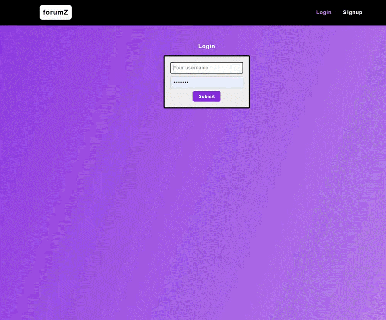
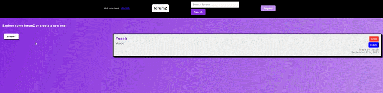
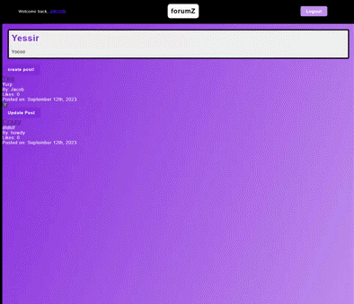
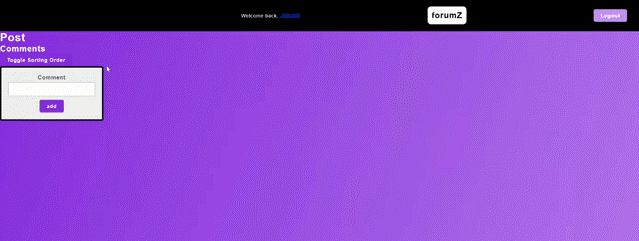

# forumZ

[deployed link here!](https://forumz-090c0b5b4bff.herokuapp.com/)

## Description
forumZ is a community driven forum sharing platform inspired by Reddit. Here you can create your own forumZ, add posts to those forums and interact with other users via comments and replies. Feel free to create your own account and start exploring!

Here are the technologies we used to make this application possible:
- Express
- React
- Apollo GraphQL (an alternative to RESTful APIs)
- MongoDB with Mongoose
- JWT (javascript web tokens)
- Bcrypt (for password hashing)
- Cloudinary (for media uploads)
- SweetAlerts2
- CSS

## Table of Contents
- [Installation](#installation)
- [Usage](#usage)
- [License](#license)
- [Contributing](#contributing)
- [Tests](#tests)
- [Questions](#questions)

## Installation
To install our project on your local computer, you must follow these steps chronologically:
 
 
1: clone the repo to your computer
 
2: run `npm install` in the root directory of the cloned repo to install the required dependencies
 
3: run `npm run develop` in the root directory
 
4: That's it! the cloned project should now be running on your local machine at PORT 3000

## Usage
Login to create account
 

 
 
Create a Forum
 

 
 
Create a post
 

 
 
Add a comment
 

## License
This application is covered under the MIT license.

## Contributing
- Jacob Kachmarek: [Github](https://github.com/jacob-kachmarek) [LinkedIn](https://www.linkedin.com/in/jacob-kachmarek/)
- Jordan Lopez: [Github](https://github.com/Lopez-Jordan) [LinkedIn](https://www.linkedin.com/in/jordanlopez123/)
- Ross Fahan: [Github](https://github.com/RossFahan) [LinkedIn](https://www.linkedin.com/in/rossfahan/)
- Thomas Munzar: [Github](https://github.com/ThomasMunzar) [LinkedIn](https://www.linkedin.com/in/thomas-munzar-659b51250/)

## Questions
For questions about the project, you can reach us via email (provided above)
    